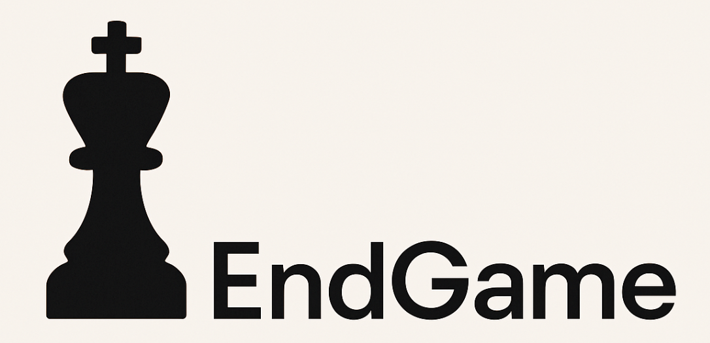

  

End Game is a sleek and modern web app that lets players play chess with their friends and 
generate brackets using ChatGPT.

## 📚 Table of Contents
- [💬 Introduction](#-introduction)
- [🚀 Features](#-features)
- [🧰 Tech Stack](#-tech-stack)
- [📝 License](#-license)
- [👥 Contributors](#-contributors)
- [🙏 Acknowledgments](#-acknowledgments)

## 💬 Introduction
Welcome to EndGame! This app brings together a secure login and registration system, 
a sleek splash screen, and a fully customizable profile page — all wrapped in a modern dark mode option for ultimate user comfort. 
It also has real-time database views. Challenge yourself with a chess game and design a full tournament brackets for you
and your friends with the help of ChatGPT.

## 🚀 Features
- Login Page: Secure authentication system for user access.
- Splash Screen: Introductory loading screen before the main app.
- Registration Page: Form to create new user accounts.
- Profile Page: View and edit user information.
- Dark Mode: Toggleable dark theme for the main menu.
- Database View: Display of players in a tournament (Microsoft Azure).
- Chess Game Page: Interface to play chess within the application.
- Tournament Bracket Designer: Tool to create and manage tournament brackets (assisted by ChatGPT).

## 🧰 Tech Stack

## 📝 License
This project uses the MIT license.

## 👥 Contributors

| [ @Jason Devaraj](https://github.com/d-jason32) | [ @Jaspreet Singh](https://github.com/jaspreet2004) | [ @Shahran Islam](https://github.com/Shahran-Islam) | [ @Melvin Salamo](https://github.com/melvinsalamo) |
|:-----------------------------------------------------------------------------------------------------------------------:|:------------------------------------------------------------------------------------------------------------------------------:|:-------------------------------------------------------------------------------------------------------------------------------:|:-----------------------------------------------------------------------------------------------------------------------------:| 

## 🙏 Acknowledgments

- Special thanks to **Prof. Stephen Hooghuis** for his guidance and support throughout the development of this project.